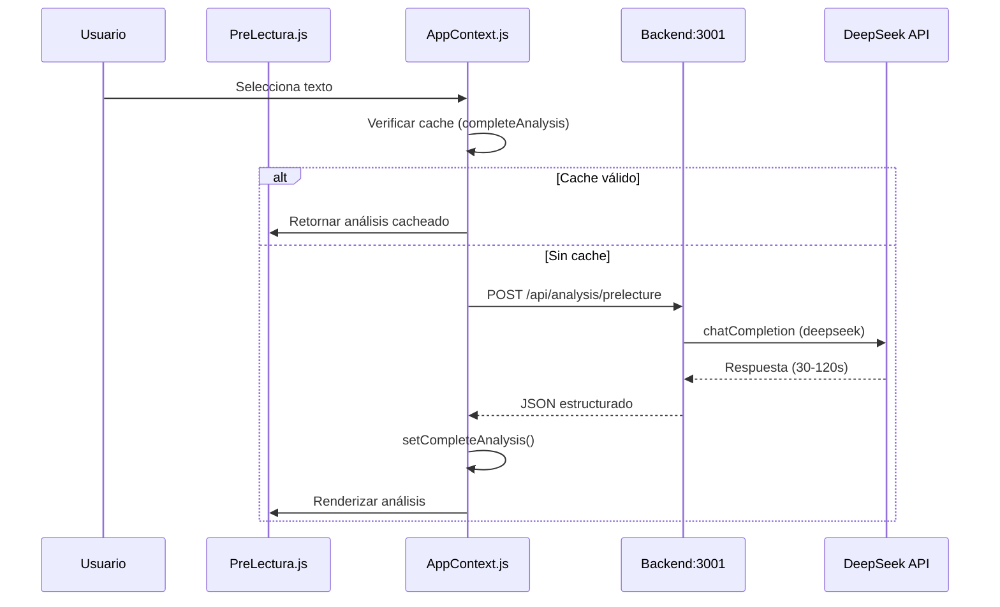

# 📊 AUDITORÍA: SISTEMA DE CARGA Y ANÁLISIS DE TEXTOS

**Fecha:** 12 de diciembre de 2025  
**Estado:** 🔍 ANÁLISIS INICIAL

---

## 📋 RESUMEN EJECUTIVO

El usuario reporta:
1. **POST lento de ~101 segundos** al endpoint `/api/analysis/prelecture`
2. **Análisis ocasionalmente no se carga** y al dar click en "Reintentar" se recarga toda la página
3. **Segunda carga es rápida** (datos en memoria/cache)

---

## 🔬 FLUJO DE ANÁLISIS — ARQUITECTURA ACTUAL



---

## 🐛 PROBLEMAS IDENTIFICADOS

### A1: POST lento (>100 segundos) — MODERADA
**Ubicación:** Backend → DeepSeek API  
**Síntoma:** `⚠️Lento POST /api/analysis/prelecture -> 101142ms`  
**Causa raíz:**
- DeepSeek API tiene latencia variable (30s - 120s+)
- RAG enrichment agrega tiempo adicional
- Textos largos generan prompts extensos

**Evidencia:**
```javascript
// textAnalysisOrchestrator.js:88
timeoutMs: 90000   // 90s para análisis profundo
```

---

### A2: Retry button recarga página completa — CRÍTICA
**Ubicación:** [PreLectura.js:240](file:///c:/Users/User/Documents/AppLectura/src/components/PreLectura.js#L240)  
**Síntoma:** Click en "Reintentar" causa `window.location.reload()`  
**Impacto:**
- Pierde todo estado de la aplicación
- Requiere re-autenticación potencial
- No aprovecha cache de texto ya cargado

**Código actual:**
```javascript
<button onClick={() => window.location.reload()}>
  Reintentar
</button>
```

**Solución propuesta:**
```javascript
// Exponer función retryAnalysis desde AppContext
<button onClick={() => analyzeDocument(texto)}>
  Reintentar análisis
</button>
```

---

### A3: Sin indicador de progreso granular — MENOR
**Ubicación:** [PreLectura.js:142-202](file:///c:/Users/User/Documents/AppLectura/src/components/PreLectura.js#L142-L202)  
**Síntoma:** Solo muestra spinner genérico durante 1-2 minutos  
**Impacto:** Usuario no sabe si la app se congeló

**Estado actual:**
```javascript
if (isLoading) {
  return (
    <LoadingState>
      <LoadingSpinner>📊</LoadingSpinner>
      <LoadingTitle>Analizando documento...</LoadingTitle>
      <ProgressBar animate={{ width: "100%" }} duration={60} />
    </LoadingState>
  );
}
```

**Problema:** La barra de progreso tarda 60s en llenarse pero el análisis puede tardar 100s+

---

### A4: Sin retry automático en fallas de red — MODERADA
**Ubicación:** [AppContext.js:1461-1497](file:///c:/Users/User/Documents/AppLectura/src/context/AppContext.js#L1461-L1497)  
**Síntoma:** Si falla la petición, se muestra fallback sin reintentar  
**Impacto:** Errores transitorios no se recuperan

**Código actual:**
```javascript
} catch (err) {
  if (err.name === 'AbortError') {
    setError('El análisis tardó demasiado tiempo...');
  } else {
    setError(`Error en análisis: ${err.message}`);
  }
  // Se crea fallback, NO hay retry
  setCompleteAnalysis({ _isFallback: true, ... });
}
```

---

### A5: Timeout inconsistente entre capas — MENOR
**Ubicación:** Múltiples archivos  
**Síntoma:** Diferentes timeouts causan confusión

| Capa | Timeout | Archivo |
|------|---------|---------|
| AppContext | 300s (5 min) | AppContext.js:1371 |
| Orchestrator | 90s | textAnalysisOrchestrator.js:88 |
| unifiedAiService | 45s | unifiedAiService.js:35 |

**Impacto:** El orchestrator puede abortar antes que AppContext complete

---

### A6: Cache no persistente entre sesiones — MENOR
**Ubicación:** [AppContext.js:1310-1355](file:///c:/Users/User/Documents/AppLectura/src/context/AppContext.js#L1310-L1355)  
**Síntoma:** Solo verifica `completeAnalysis` en memoria  
**Impacto:** Reload de página requiere re-análisis

**Cache actual:**
1. ✅ Sesión con `completeAnalysis` en localStorage
2. ✅ Hash de documento para comparación
3. ❌ No verifica cache antes de llamar API si no hay sesión activa

---

## 📋 MATRIZ DE PRIORIZACIÓN — FINAL

| # | Problema | Impacto | Esfuerzo | Prioridad | Estado |
|---|----------|---------|----------|-----------|--------|
| A2 | Retry recarga página | Alto | Bajo | 🔴 1 | ✅ **CORREGIDO** |
| A4 | Sin retry automático | Medio | Medio | 🟠 2 | ✅ **CORREGIDO** |
| A1 | POST lento DeepSeek | Alto | Alto | 🟠 3 | ✅ **CORREGIDO** |
| A3 | Sin progreso granular | Bajo | Medio | 🟡 4 | ✅ **CORREGIDO** |
| A5 | Timeout inconsistente | Bajo | Bajo | 🟡 5 | ✅ **CORREGIDO** |
| A6 | Cache no persistente | Bajo | Medio | 🟡 6 | ✅ **CORREGIDO** |

---

## 🎯 PLAN DE ACCIÓN RECOMENDADO

### Fase 1: Correcciones Críticas
- [ ] **A2**: Reemplazar `window.location.reload()` con llamada a `analyzeDocument()`
- [ ] **A4**: Agregar retry automático (1 intento) para errores de red

### Fase 2: Mejoras de UX
- [ ] **A3**: Implementar progreso basado en eventos del backend
- [ ] **A5**: Unificar timeouts en una constante compartida

### Fase 3: Optimizaciones
- [ ] **A1**: Implementar streaming de respuesta del backend
- [ ] **A6**: Verificar cache de sesión antes de llamar API

---

## 📊 ARCHIVOS CLAVE

| Archivo | Función | Líneas clave |
|---------|---------|--------------|
| [AppContext.js](file:///c:/Users/User/Documents/AppLectura/src/context/AppContext.js) | Orquestación de análisis | 1310-1502 |
| [PreLectura.js](file:///c:/Users/User/Documents/AppLectura/src/components/PreLectura.js) | UI de pre-lectura | 142-258 |
| [textAnalysisOrchestrator.js](file:///c:/Users/User/Documents/AppLectura/src/services/textAnalysisOrchestrator.js) | Análisis con IA | 44-204 |
| [unifiedAiService.js](file:///c:/Users/User/Documents/AppLectura/src/services/unifiedAiService.js) | Llamadas a backend | 13-58 |
