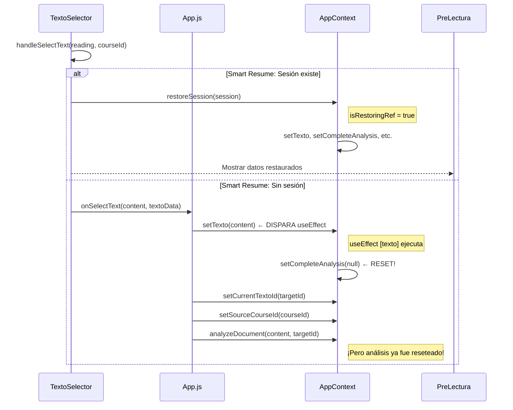

# 🔍 AUDITORÍA PROFUNDA: Flujo de Carga de Lecturas

**Fecha:** 14 de diciembre de 2025  
**Objetivo:** Identificar todos los problemas que causan contaminación de datos entre lecturas

---

## 📊 FLUJO ACTUAL DE CARGA DE LECTURA



---

## 🚨 PROBLEMAS IDENTIFICADOS

### P1: Orden de Actualizaciones de Estado (CRÍTICO)
**Archivo:** `App.js:493-540`

```javascript
// PROBLEMA: Orden actual
setTexto(content);           // 1. Dispara useEffect [texto]
setCurrentTextoId(targetId); // 2. Llega tarde
analyzeDocument(content);    // 3. Puede perder contra reset
```

El `useEffect([texto])` en AppContext corre **inmediatamente** cuando `setTexto` cambia, pero `currentTextoId` todavía tiene el valor **anterior**.

**Impacto:** El log del console mostrará `textoId: anterior` en lugar del nuevo.

---

### P2: useEffect con Dependencia Incompleta
**Archivo:** `AppContext.js:2259-2272`

```javascript
useEffect(() => {
  console.log(`... (textoId: ${currentTextoId || 'ninguno'})`);
  // currentTextoId ESTÁ DESACTUALIZADO cuando esto corre
  setCompleteAnalysis(null);
}, [texto]); // ← Solo depende de texto, no de currentTextoId
```

**Problema:** El useEffect usa `currentTextoId` internamente pero no lo tiene como dependencia. Esto significa que cuando `texto` cambia, `currentTextoId` todavía tiene el valor del texto **anterior**.

---

### P3: Race Condition entre Reset y Análisis
**Archivo:** `App.js:536-538`

```javascript
// En handleSelectText:
setTexto(content); // → dispara reset de análisis (async via React)
analyzeDocument(content, targetId); // → genera nuevo análisis

// PROBLEMA: React batching puede hacer que:
// 1. analyzeDocument genera análisis
// 2. useEffect[texto] borra el análisis recién generado
```

---

### P4: Smart Resume vs Carga Normal
**Archivo:** `TextoSelector.js:336-352`

Cuando Smart Resume encuentra una sesión:
```javascript
await restoreSession(existingSession); // Restaura todo
return; // SALE de handleSelectText
```

Pero cuando NO hay sesión:
```javascript
onSelectText(contenido, { ...docData, sourceCourseId }); // Llama a App.js
```

**Problema:** Dos caminos completamente diferentes. Si Smart Resume falla parcialmente, el estado queda inconsistente.

---

### P5: Código Muerto del Cache en Memoria
**Archivo:** `AppContext.js:121-124`

```javascript
const analysisCacheRef = useRef({});
const ANALYSIS_CACHE_MAX = 5;
```

Este código ya no se usa después de las simplificaciones, pero sigue en el archivo.

---

### P6: Cache de localStorage no se Invalida al Cambiar
**Archivo:** `AppContext.js:1385-1406`

El cache de localStorage se genera con `analysis_cache_tid_${textoId}`, pero:
- Si un texto se actualiza en Firestore, el cache local está obsoleto
- No hay invalidación cuando el contenido cambia

---

### P7: Falta Estado Atómico "Lectura Activa"
**Problema Fundamental**

No existe un único estado que represente "qué lectura está activa". En su lugar, hay múltiples estados que deben estar sincronizados:
- `texto` (contenido)
- `currentTextoId` (ID)
- `sourceCourseId` (curso)
- `completeAnalysis` (análisis)
- `rubricProgress` (evaluaciones)

Cuando uno cambia, los demás deben actualizarse **atómicamente**, pero actualmente cada uno cambia de forma independiente.

---

## 🎯 SOLUCIÓN PROPUESTA

### Opción A: Cambio de Estado Atómico (Recomendado)

Crear un único estado compuesto para la lectura activa:

```javascript
const [activeLecture, setActiveLecture] = useState({
  textoId: null,
  courseId: null,
  content: '',
  analysis: null,
  rubricProgress: emptyRubricProgress
});

// Un solo setter que actualiza todo atómicamente
const switchLecture = useCallback((textoId, courseId, content) => {
  setActiveLecture({
    textoId,
    courseId,
    content,
    analysis: null, // Reset limpio
    rubricProgress: emptyRubricProgress
  });
  
  // Luego cargar datos desde cache/Firestore
  loadLectureData(textoId, courseId);
}, []);
```

**Pros:** Garantiza consistencia, imposible tener estados mezclados
**Contras:** Requiere refactor significativo

---

### Opción B: Corrección de Orden (Mínima)

Cambiar el orden en `handleSelectText`:

```javascript
// NUEVO ORDEN:
setCurrentTextoId(targetId);     // 1. Primero el ID
setSourceCourseId(courseId);     // 2. Luego el curso
clearRubricProgress();           // 3. Limpiar evaluaciones
setTexto(content);               // 4. Texto al final (dispara useEffect)
analyzeDocument(content, targetId); // 5. Análisis
```

**Pros:** Cambio mínimo
**Contras:** Sigue siendo vulnerable a race conditions

---

### Opción C: useEffect con Batch (Intermedia)

Usar `flushSync` o un estado intermedio para forzar sincronización:

```javascript
// En App.js handleSelectText:
ReactDOM.flushSync(() => {
  setCurrentTextoId(targetId);
  setSourceCourseId(courseId);
  setTexto(content);
});
// Ahora todos los estados están actualizados
analyzeDocument(content, targetId);
```

---

## 📋 RECOMENDACIÓN

**Implementar Opción B** primero (orden de estado) y monitorear. Si persisten problemas, evolucionar hacia **Opción A** (estado atómico).

**Cambios inmediatos a realizar:**
1. Cambiar orden de `setTexto` a último en `handleSelectText`
2. Agregar `currentTextoId` como dependencia del useEffect
3. Limpiar código de cache en memoria no usado
4. Agregar logs para diagnosticar el flujo
