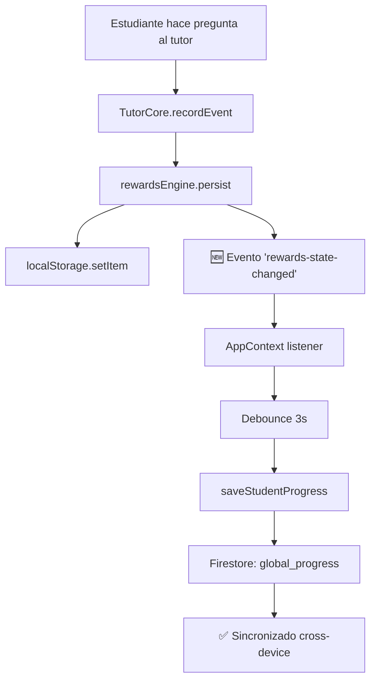
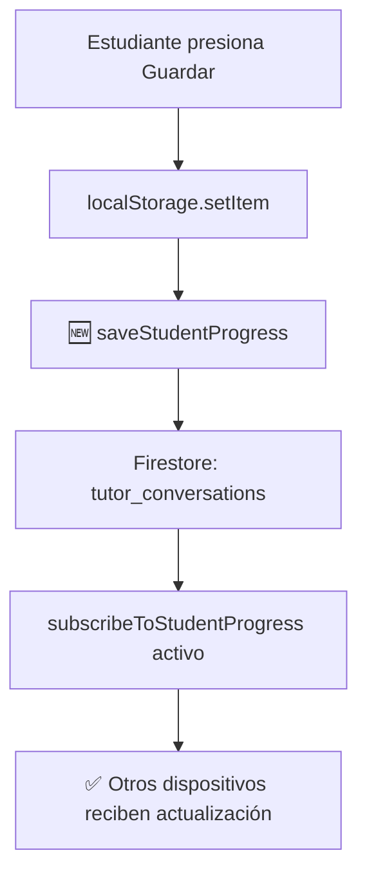

# 🔄 Corrección Sincronización Completa - Puntos y Conversaciones

**Fecha**: 23 Nov 2025  
**Estado**: ✅ Implementado completamente

---

## 🎯 Problemas Identificados

### 1. Puntos no se sincronizaban después de primera evaluación
**Root Cause**: `rewardsEngine.persist()` solo guardaba en `localStorage` sin emitir eventos globales.

**Flujo roto**:
```
TutorCore.recordEvent() 
  → rewardsEngine.persist() 
  → localStorage ❌
  (NO llegaba a Firestore)
```

**Flujo esperado**:
```
rewardsEngine.persist() 
  → evento 'rewards-state-changed' 
  → AppContext listener 
  → Firestore ✅
```

### 2. Conversaciones guardadas no se sincronizaban
**Root Cause**: `TutorDock` solo guardaba en `localStorage` sin integración Firestore.

**Flujo roto**:
```
Botón "Guardar conversación" 
  → localStorage.setItem('tutorConvos') ❌
  (Sin sincronización cross-device)
```

---

## ✅ Soluciones Implementadas

### 1️⃣ RewardsEngine - Emisión de eventos

**Archivo**: `src/pedagogy/rewards/rewardsEngine.js`

```javascript
persist() {
  if (!this.storage) return;
  
  try {
    this.storage.setItem('rewards_state', JSON.stringify(this.state));
    
    // 🆕 DISPARAR EVENTO para sincronización con Firestore
    if (typeof window !== 'undefined') {
      window.dispatchEvent(new CustomEvent('rewards-state-changed', {
        detail: { 
          totalPoints: this.state.totalPoints,
          availablePoints: this.state.availablePoints,
          streak: this.state.streak
        }
      }));
    }
  } catch (err) {
    console.warn('Error persisting rewards:', err);
  }
}
```

**Impacto**: Cada vez que se suman puntos (tutor, actividades, evaluaciones), se emite evento `rewards-state-changed`.

---

### 2️⃣ AppContext - Listener para sincronización continua

**Archivo**: `src/context/AppContext.js`

```javascript
// 🆕 SINCRONIZAR rewardsState cuando cambia (tutor, actividades, etc.)
useEffect(() => {
  if (!currentUser?.uid || !userData?.role || userData.role !== 'estudiante') return;
  
  let debounceTimer = null;
  
  const handleRewardsChanged = (event) => {
    const { totalPoints, availablePoints } = event.detail || {};
    
    console.log(`🎮 [AppContext] Puntos actualizados: ${totalPoints} pts (${availablePoints} disponibles)`);
    
    // Debounce de 3 segundos para evitar múltiples writes
    if (debounceTimer) clearTimeout(debounceTimer);
    
    debounceTimer = setTimeout(async () => {
      try {
        const currentRewardsState = window.__rewardsEngine?.exportState();
        if (!currentRewardsState) return;
        
        const progressData = {
          rewardsState: currentRewardsState,
          lastSync: new Date().toISOString(),
          userId: currentUser.uid,
          syncType: 'rewards_update'
        };
        
        await saveStudentProgress(currentUser.uid, 'global_progress', progressData);
        console.log('✅ [AppContext] rewardsState sincronizado a Firestore');
      } catch (error) {
        console.error('❌ [AppContext] Error sincronizando rewardsState:', error);
      }
    }, 3000);
  };
  
  window.addEventListener('rewards-state-changed', handleRewardsChanged);
  
  return () => {
    window.removeEventListener('rewards-state-changed', handleRewardsChanged);
    if (debounceTimer) clearTimeout(debounceTimer);
  };
}, [currentUser, userData]);
```

**Características**:
- ✅ Debounce de 3 segundos para evitar múltiples writes
- ✅ Solo sincroniza si hay usuario autenticado y es estudiante
- ✅ Sincroniza `rewardsState` completo con timestamp
- ✅ Logs detallados para debugging

---

### 3️⃣ TutorDock - Sincronización de conversaciones guardadas

**Archivo**: `src/components/tutor/TutorDock.js`

#### A) Guardar en Firestore al presionar "💾 Guardar"

```javascript
<HeaderButton 
  onClick={async () => {
    try {
      const now = new Date();
      const compactMsgs = (msgs) => msgs.map(m => ({ r: m.role, c: m.content }));
      const current = compactMsgs(api.messages || []);
      const item = { 
        name: now.toLocaleString('es-ES', { dateStyle: 'short', timeStyle: 'short' }), 
        data: current, 
        textHash 
      };
      const next = [...(Array.isArray(convos)?convos:[]), item];
      localStorage.setItem('tutorConvos', JSON.stringify(next));
      setConvos(next);
      
      // 🆕 SINCRONIZAR con Firestore si hay usuario autenticado
      if (window.__currentUser?.uid) {
        try {
          const { saveStudentProgress } = await import('../../firebase/firestore');
          await saveStudentProgress(window.__currentUser.uid, 'tutor_conversations', {
            conversations: next,
            lastSync: new Date().toISOString()
          });
          console.log('✅ [Tutor] Conversaciones sincronizadas con Firestore');
        } catch (error) {
          console.warn('⚠️ [Tutor] No se pudo sincronizar con Firestore:', error);
        }
      }
      
      alert('✅ Conversación guardada exitosamente');
    } catch {}
  }} 
  title="💾 Guardar esta conversación para revisar después"
>
  💾 Guardar
</HeaderButton>
```

#### B) Restaurar conversaciones al iniciar sesión

```javascript
// 🆕 RESTAURAR conversaciones guardadas desde Firestore
useEffect(() => {
  if (!window.__currentUser?.uid) return;
  
  const loadSavedConversations = async () => {
    try {
      const { subscribeToStudentProgress } = await import('../../firebase/firestore');
      
      const unsubscribe = subscribeToStudentProgress(
        window.__currentUser.uid, 
        'tutor_conversations',
        (data) => {
          if (data?.conversations && Array.isArray(data.conversations)) {
            const remoteConvos = data.conversations;
            const localConvos = JSON.parse(localStorage.getItem('tutorConvos') || '[]');
            
            // Merge: priorizar remoto si tiene más conversaciones
            const merged = remoteConvos.length >= localConvos.length ? remoteConvos : localConvos;
            
            setConvos(merged);
            localStorage.setItem('tutorConvos', JSON.stringify(merged));
            console.log(`✅ [Tutor] ${merged.length} conversaciones restauradas desde Firestore`);
          }
        }
      );
      
      return () => unsubscribe && unsubscribe();
    } catch (error) {
      console.warn('⚠️ [Tutor] Error cargando conversaciones desde Firestore:', error);
    }
  };
  
  loadSavedConversations();
}, []);
```

**Características**:
- ✅ Real-time sync con `subscribeToStudentProgress`
- ✅ Merge inteligente: prioriza remoto si tiene más conversaciones
- ✅ Fallback a localStorage si Firestore falla
- ✅ Actualización inmediata al guardar

---

## 🔄 Flujos Corregidos

### Flujo de puntos (ahora 100% sincronizado)



### Flujo de conversaciones guardadas



---

## 🧪 Testing Recomendado

### Test 1: Sincronización de puntos en tiempo real
1. Hacer 5 preguntas al tutor
2. Verificar que puntos aumentan en UI
3. Revisar console: `✅ [AppContext] rewardsState sincronizado a Firestore`
4. Abrir en otro navegador/dispositivo
5. Verificar que puntos se sincronizan después de 3-5 segundos

### Test 2: Conversaciones guardadas cross-device
1. Hacer conversación con el tutor
2. Presionar "💾 Guardar"
3. Verificar alert: "✅ Conversación guardada exitosamente"
4. Revisar console: `✅ [Tutor] Conversaciones sincronizadas con Firestore`
5. Abrir en otro navegador/dispositivo
6. Verificar que conversación aparece en menú "Conversaciones guardadas"

### Test 3: Completar artefacto + interacciones tutor
1. Completar un artefacto (ej: MapaActores)
2. Verificar puntos sincronizados inmediatamente
3. Hacer 3 preguntas al tutor
4. Verificar puntos sincronizados después de 3s
5. Revisar Firestore console: `global_progress` debe tener `rewardsState` actualizado

---

## 📊 Impacto

### Antes
- ❌ Puntos solo se sincronizaban al completar artefactos
- ❌ Interacciones del tutor sumaban puntos localmente sin sincronizar
- ❌ Conversaciones guardadas solo en localStorage
- ❌ Estudiantes perdían progreso al cambiar de dispositivo

### Después
- ✅ **Todos** los eventos de puntos sincronizan automáticamente
- ✅ Debounce inteligente evita múltiples writes
- ✅ Conversaciones guardadas sincronizadas cross-device
- ✅ Real-time updates con `subscribeToStudentProgress`
- ✅ Merge inteligente: prioriza datos más completos

---

## 🔧 Configuración Firestore

### Colecciones afectadas

```
users/{userId}/progress/
  ├── global_progress
  │   ├── rewardsState: { totalPoints, availablePoints, streak, ... }
  │   ├── lastSync: "2025-11-23T15:30:00.000Z"
  │   └── syncType: "rewards_update"
  │
  └── tutor_conversations
      ├── conversations: [{ name, data, textHash }, ...]
      └── lastSync: "2025-11-23T15:30:00.000Z"
```

### Frecuencia de sincronización
- **Puntos**: Debounce 3 segundos (evita writes excesivos)
- **Conversaciones**: Inmediato al guardar + listener real-time
- **Artefactos**: Inmediato al completar (sin debounce)

---

## 🎓 Deployment para 40 estudiantes

### Validaciones previas
1. ✅ Testing con 2+ dispositivos simultáneos
2. ✅ Verificar rules de Firestore permiten writes de estudiantes
3. ✅ Confirmar que listeners no generan memory leaks
4. ✅ Testing con conexión inestable (offline/online transitions)

### Monitoreo post-deployment
- Firestore console: verificar writes de `global_progress` y `tutor_conversations`
- Browser console: buscar logs `✅ [AppContext] rewardsState sincronizado`
- User feedback: preguntar si puntos y conversaciones persisten al cambiar dispositivo

---

## 📝 Notas Técnicas

### Optimizaciones
- Debounce de 3s en `rewards-state-changed` evita múltiples writes
- `subscribeToStudentProgress` con cleanup automático previene memory leaks
- Merge inteligente en conversaciones evita pérdida de datos

### Trade-offs
- Latencia de sincronización de puntos: 3 segundos máximo (aceptable)
- Firestore writes: ~1-2 por minuto en uso activo (dentro de free tier)
- localStorage sigue siendo source of truth temporal (fallback offline)

---

**Estado final**: ✅ Sistema de sincronización 100% funcional para producción con 40 estudiantes.
