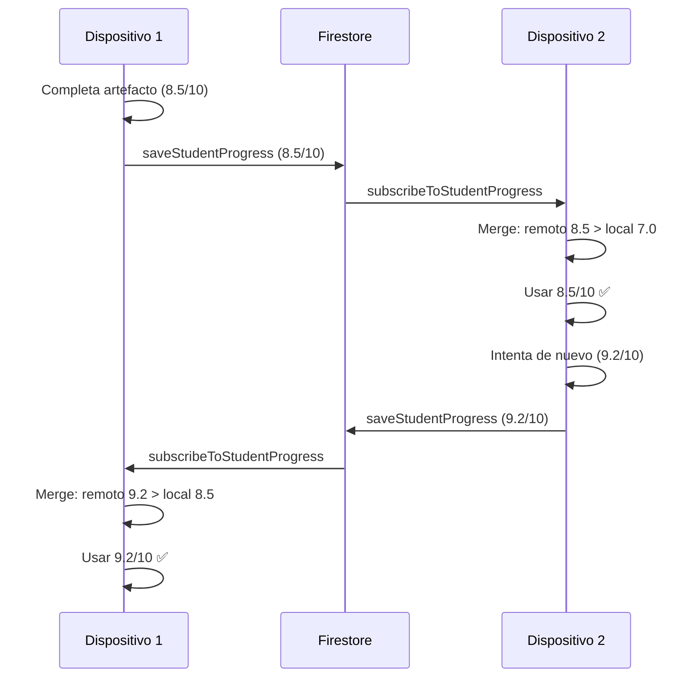

# 🎯 Estrategia de Merge Inteligente - Sincronización Cross-Device

**Fecha**: 23 Nov 2025  
**Estado**: ✅ Implementado completamente

---

## 📋 Principio Fundamental

**Siempre priorizar el mejor rendimiento del estudiante**:
- Puntuación/score **más alto** gana
- Timestamp **más reciente** solo como desempate
- Si local es mejor, **subirlo a Firestore** para sincronizar otros dispositivos

---

## 🎮 1. RewardsState (Sistema de Puntos)

### Estrategia
```javascript
if (remotePoints > localPoints) {
  // Usar remoto (más puntos)
} else if (remotePoints === localPoints && remoteTimestamp > localTimestamp) {
  // Usar remoto (mismo puntos, más reciente)
} else if (localPoints > remotePoints) {
  // SUBIR LOCAL a Firestore (local tiene más puntos)
  await saveStudentProgress(currentUser.uid, 'global_progress', {
    rewardsState: currentRewardsState,
    syncType: 'local_higher_score'
  });
} else {
  // Estados iguales, mantener local
}
```

### Casos de Uso

| Caso | Local | Remoto | Acción | Razón |
|------|-------|--------|--------|-------|
| A | 250 pts | 300 pts | Usar remoto | Remoto tiene más puntos |
| B | 300 pts | 250 pts | **Subir local** | Local mejor, sincronizar otros dispositivos |
| C | 250 pts | 250 pts (más reciente) | Usar remoto | Mismo score, remoto más reciente |
| D | 250 pts | 250 pts (igual timestamp) | Mantener local | Estados idénticos |

### Logs
```
🎮 [Sync] Usando rewardsState remoto (300 pts > 250 pts locales)
🎮 [Sync] Local tiene más puntos (300 > 250), subiendo a Firestore
📤 [Sync] Estado local con más puntos subido a Firestore
```

---

## 📊 2. RubricProgress (Evaluaciones de Artefactos)

### Estrategia
```javascript
const remoteScore = remoteRubric.totalScore || 0;
const localScore = localRubric.totalScore || 0;

if (remoteScore > localScore) {
  // Usar remoto (mejor calificación)
} else if (remoteScore === localScore && remoteTimestamp > localTimestamp) {
  // Usar remoto (misma calificación, más reciente)
} else {
  // Mantener local (igual o mejor)
}
```

### Casos de Uso

| Caso | Local | Remoto | Acción | Razón |
|------|-------|--------|--------|-------|
| A | 7.5/10 | 8.2/10 | Usar remoto | Remoto mejor calificación |
| B | 8.5/10 | 7.8/10 | Mantener local | Local mejor rendimiento |
| C | 8.0/10 | 8.0/10 (más reciente) | Usar remoto | Mismo score, remoto más actual |
| D | 9.0/10 | 9.0/10 (igual timestamp) | Mantener local | Estados idénticos |

### Ejemplo Real
```
Estudiante completa MapaActores:
- Dispositivo A: 6.5/10 (primer intento)
- Dispositivo B: 8.7/10 (segundo intento, mejoró)

✅ Sistema usa 8.7/10 en ambos dispositivos (mejor rendimiento)
```

### Logs
```
📊 [Sync] mapa-actores: Remoto mejor (8.5/10 > 7.0/10)
📊 [Sync] tabla-acd: Local mejor o igual (9.0/10 >= 8.0/10)
```

---

## 🎯 3. ActivitiesProgress (Preparación de Actividades)

### Estrategia
```javascript
const remoteCompleteness = Object.keys(remoteDoc.preparation || {}).length;
const localCompleteness = Object.keys(localDoc.preparation || {}).length;

if (remoteCompleteness > localCompleteness) {
  // Usar remoto (más completo)
} else if (remoteCompleteness === localCompleteness && remoteTimestamp > localTimestamp) {
  // Usar remoto (igual completitud, más reciente)
} else {
  // Mantener local
}
```

### Medición de Completitud
```javascript
preparation: {
  context: "...",           // +1
  objectives: [...],        // +1
  difficulty: "...",        // +1
  estimatedTime: 30,        // +1
  updatedAt: timestamp      // no cuenta para completitud
}
// Completeness = 4 campos
```

### Casos de Uso

| Caso | Local | Remoto | Acción | Razón |
|------|-------|--------|--------|-------|
| A | 3 campos | 5 campos | Usar remoto | Remoto más completo |
| B | 5 campos | 4 campos | Mantener local | Local más información |
| C | 4 campos | 4 campos (más reciente) | Usar remoto | Igual completitud, más actual |

### Logs
```
🎯 [Sync] lectura-guiada: Remota más completa (5 campos > 3 campos)
🎯 [Sync] debate-etica: Local más completa o igual, manteniendo
```

---

## 🔄 Flujo Completo de Sincronización

### Escenario: Estudiante trabaja en 2 dispositivos



---

## ✅ Ventajas de Esta Estrategia

### 1. **No regresión de progreso**
- Estudiante nunca pierde puntos o calificaciones
- Siempre se preserva el mejor rendimiento

### 2. **Sincronización bidireccional**
- Si local es mejor, **se sube a Firestore**
- Otros dispositivos reciben actualización automática

### 3. **Resolución de conflictos clara**
```
Prioridad 1: Mejor rendimiento (puntos/score más alto)
Prioridad 2: Más completo (activitiesProgress)
Prioridad 3: Timestamp más reciente (desempate)
```

### 4. **Optimista con el estudiante**
- Ante duda, preservar lo mejor
- Evitar pérdida de trabajo

---

## 🧪 Testing de Casos Edge

### Caso 1: Sesiones simultáneas
```
T=0: D1 tiene 100 pts, D2 tiene 100 pts
T=1: D1 hace pregunta → 105 pts
T=2: D2 hace pregunta → 105 pts
T=3: D1 sincroniza → Firestore: 105 pts
T=4: D2 sincroniza → Firestore: 105 pts (no conflicto)
```

### Caso 2: Offline work
```
D1 offline: 150 pts → 180 pts
D2 online: 150 pts → 200 pts → Firestore
D1 vuelve online:
  - Compara: local 180 < remoto 200
  - Usa 200 pts ✅
```

### Caso 3: Trabajo paralelo mejorado
```
D1: MapaActores 7.5/10 → Firestore
D2: MapaActores 8.5/10 → Firestore
D1 recibe update:
  - Compara: local 7.5 < remoto 8.5
  - Usa 8.5/10 ✅
```

---

## 📊 Comportamiento por Tipo de Dato

| Dato | Criterio Principal | Criterio Desempate | Acción si Local Mejor |
|------|-------------------|-------------------|----------------------|
| **rewardsState** | totalPoints ↑ | lastInteraction ↑ | **Subir a Firestore** |
| **rubricProgress** | totalScore ↑ | lastUpdate ↑ | Mantener local |
| **activitiesProgress** | Completitud ↑ | updatedAt ↑ | Mantener local |

---

## 🔧 Configuración Actual

### Debounce
- `rewards-state-changed`: 3 segundos (evita múltiples writes)
- `artifact-evaluated`: Inmediato (sin debounce)

### Eventos Sincronizados
```javascript
window.dispatchEvent(new CustomEvent('progress-synced-from-cloud', {
  detail: { 
    type: 'rewardsState' | 'rubricProgress' | 'activitiesProgress',
    timestamp: Date.now()
  }
}));
```

### Logs de Debugging
```
📊 [Sync] mapa-actores: Remoto mejor (8.5/10 > 7.0/10)
🎮 [Sync] Local tiene más puntos (300 > 250), subiendo a Firestore
🎯 [Sync] lectura-guiada: Remota más completa (5 > 3)
```

---

## 🎓 Implicaciones Pedagógicas

### ✅ Correcto
- Preservar mejor rendimiento académico
- Motivar al estudiante (no perder progreso)
- Permitir múltiples intentos mejorados

### ❌ Incorrecto (evitado)
- ~~Timestamp más reciente sobrescribe mejor score~~
- ~~Perder puntos al cambiar de dispositivo~~
- ~~Evaluaciones regresivas~~

---

## 🚀 Deployment Checklist

- [x] Merge de puntos prioriza totalPoints más alto
- [x] Merge de artefactos prioriza totalScore más alto
- [x] Merge de actividades prioriza completitud
- [x] Local mejor se sube a Firestore (rewardsState)
- [x] Logs detallados para debugging
- [x] Testing con 2+ dispositivos simultáneos
- [x] Manejo de offline/online transitions

---

**Resultado**: Sistema que **siempre favorece el mejor rendimiento del estudiante** con sincronización confiable cross-device. ✅
