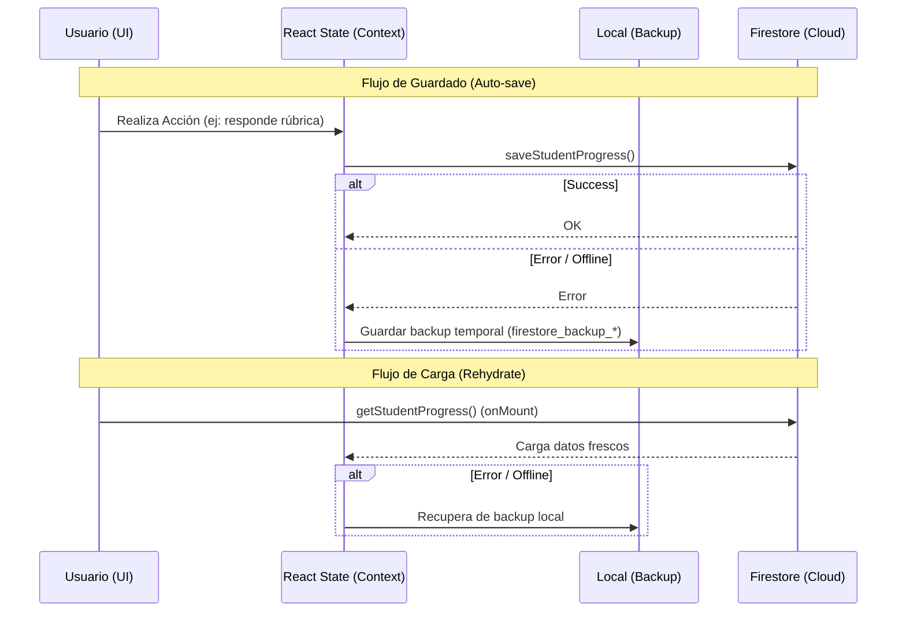
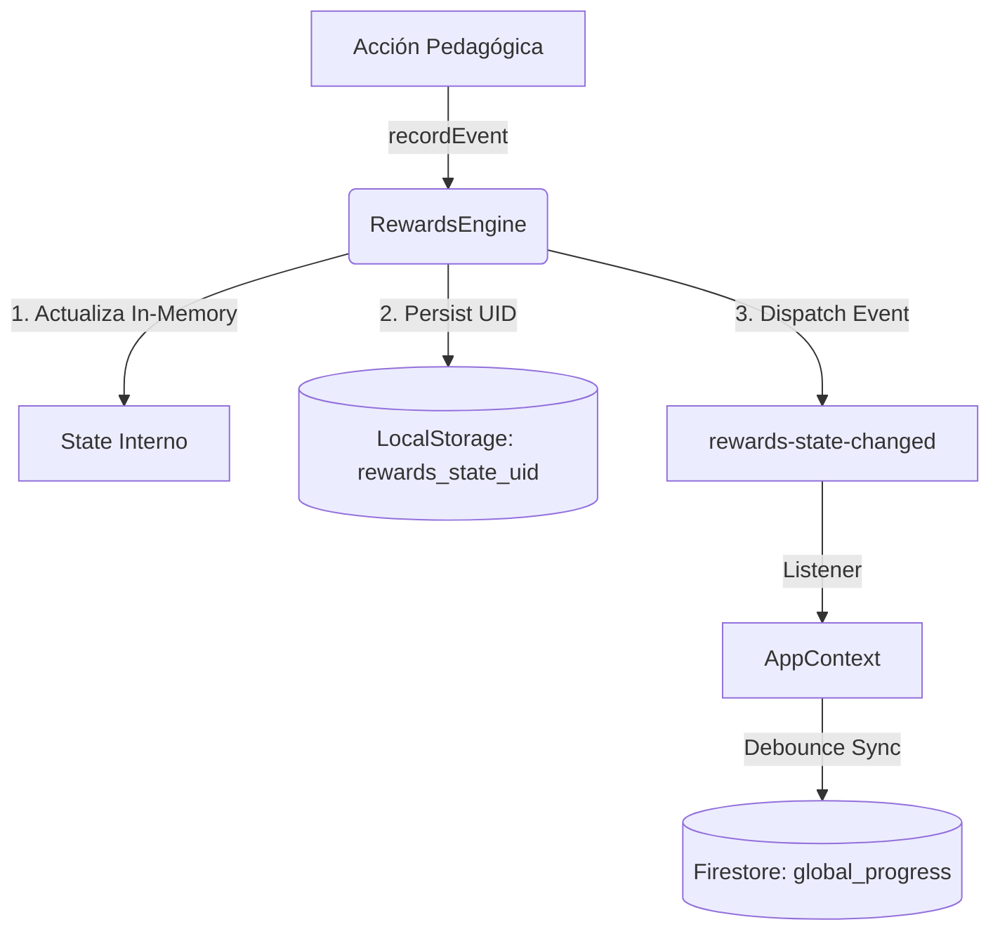
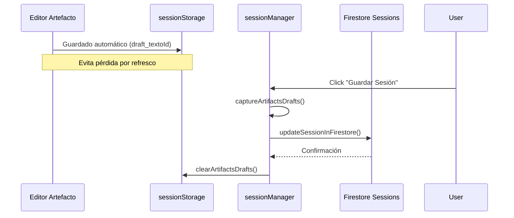

# PLAN DETALLADO — Persistencia “Cloud‑First + Local mínimo” (AppLectura)

Fecha: 28 de diciembre de 2025  
Objetivo: reducir solapamientos y “estado zombi” al consolidar una **fuente de verdad** por tipo de dato, minimizando duplicados (Firestore ↔ localStorage ↔ sessionStorage) sin perder UX (borradores) ni performance (cachés).

---

## 1) Problema actual (síntesis técnica)

### 1.1 Síntomas/riesgos que queremos eliminar
- **Solapamientos**: el mismo concepto se guarda en más de un sitio (p. ej., progreso en Firestore + espejo en localStorage).
- **Reaparición inesperada**: datos viejos “reviven” por fallback local o migraciones ambiguas.
- **Contaminación entre lecturas**: claves sin `textoId` o migraciones desde IDs legacy.
- **Contaminación multiusuario en el mismo dispositivo**: restos de backups/cachés que se “cuelan” al cambiar de cuenta.
- **Coste/ruido**: listeners + autosaves + caches duplicadas pueden aumentar writes o lecturas.

### 1.2 Módulos implicados (mapa actual)
- Progreso en Firestore: `saveStudentProgress`, `getStudentProgress`, `subscribeToStudentProgress`.
- Sync en cliente: `src/context/AppContext.js` (carga/merge + listeners).
- Gamificación: RewardsEngine (estado local + import/export) + sync en `src/context/AppContext.js` (`global_progress.rewardsState`).
- “Guardar partida” / sesiones de trabajo: `src/services/sessionManager.js` (local + Firestore).
- Backups locales por fallo: `firestore_backup_<uid>_<textoId>` (en `src/hooks/useFirestorePersistence.js`).
- Cachés de análisis: `analysis_cache_*` (TTL largo) y `text_analysis_cache` (TTL corto) en utilidades separadas.
- Borradores de artefactos: `sessionStorage` con namespacing por lectura (parcial).

---

## 1.3 Mapa de Responsabilidades (Archivos clave)

| Capa | Archivo | Responsabilidad |
| :--- | :--- | :--- |
| **Orquestación** | `src/context/AppContext.js` | Cerebro de sincronización. Gestiona el ciclo de vida del usuario y la prioridad de carga. |
| **Nube (Firestore)** | `src/firebase/firestore.js` | CRUD de bajo nivel. Interfaz única con la base de datos de Firebase. |
| **Sesiones (Work)** | `src/services/sessionManager.js` | Lógica de "Guardar Partida". Maneja el historial de lecturas y borradores de artefactos. |
| **Progreso (Hooks)** | `src/hooks/useFirestorePersistence.js` | Hook automático para guardar rúbricas/actividades mientras el usuario lee. |
| **Gamificación** | `src/pedagogy/rewards/rewardsEngine.js` | Lógica interna de puntos y racha. Persistencia namespaced por UID. |
| **Caché Análisis** | `src/hooks/useAnalysisPersistence.js` | Gestión de resultados de IA en localStorage para evitar re-análisis costosos. |
| **Caché Análisis (Core)** | `src/utils/analysisCache.js` | Implementación de caché versionada con TTL + MAX + limpieza; base del caching de análisis. |
| **Caché Análisis (Legacy)** | `src/utils/cache.js` | Caché legacy (`text_analysis_cache`) a consolidar/retirar en la Fase 1. |
| **Notas / Estudio** | `src/services/notes/StorageService.js` | Persistencia específica para el módulo de toma de notas y cronogramas. |

---

## 1.4 Esquemas de Flujo

### A. Registro de Progreso (Rúbricas/Actividades)
El flujo actual tiende a ser "Local-First". El objetivo es pasar a un flujo donde Firestore sea la verdad.

### B. Ciclo de Vida de Gamificación (Puntos/Logros)
Este flujo es especial porque usa un motor (`RewardsEngine`) desacoplado de los ciclos de render de React.

### C. Gestión de Sesiones y Borradores
Maneja la transición entre diferentes lecturas sin perder el trabajo en curso.

---

## 1.5 Solapamientos potenciales (Ownership de escritura)

### Riesgo
Actualmente coexisten dos “orquestadores” que pueden escribir/rehidratar progreso:
- `src/context/AppContext.js` (listeners + merges + guardados vía `saveStudentProgress`).
- `src/hooks/useFirestorePersistence.js` (autosave + backup local `firestore_backup_*`).

Si ambos están activos sobre el mismo dominio al mismo tiempo, puede ocurrir:
- más writes de los necesarios (aunque exista dedupe),
- rebotes snapshot→setState→save,
- y fuentes de verdad implícitas (difícil de depurar).

### Regla propuesta (para ejecutar Fase 2 con seguridad)
- Definir una única ruta responsable del guardado de `rubricProgress`/`activitiesProgress`.
  - O bien se deja `AppContext` como orquestador principal y `useFirestorePersistence` solo como “airbag” (backup en error),
  - o `useFirestorePersistence` es la vía única de autosave y `AppContext` solo rehidrata/escucha.

### Criterio de aceptación
- Para un mismo `uid` + `textoId`, existe **un solo punto** que ejecuta `saveStudentProgress()` de forma automática.

---

## 2) Principios de diseño (decisiones de arquitectura)

### 2.1 “Fuente de verdad” por dominio
1) **Progreso evaluable (rubrics/activities/rewards)**
   - Fuente de verdad: **Firestore**.
   - Local: **solo estado en memoria** y/o **persistencia offline nativa de Firestore**.
   - Motivo: consistencia multi-dispositivo y visibilidad docente.

2) **Borradores (artefactos en edición)**
   - Fuente de verdad: **local**.
   - Recomendación práctica:
     - `sessionStorage` para borradores “ligeros” (duración pestaña) que no deberían persistir días.
     - `localStorage` con TTL corto (p. ej. 24h) para artefactos largos/críticos (evita pérdida al cerrar pestaña).
   - Cloud: opcional (solo si hay “Guardar borrador en nube” explícito o autosave controlado).
   - Motivo: UX (no perder texto tecleado) y evitar writes excesivos.

3) **Cachés costosas (análisis IA, file cache)**
   - Fuente de verdad: **ninguna** (son cachés).
   - Local: permitido con TTL/límite/versionado en **un único sistema**.
   - Motivo: performance y coste.

4) **Sesiones “guardar partida” (work sessions)**
   - Decisión de producto:
     - Opción A (recomendada): **Cloud-first** (Firestore manda), local como cola/offline.
     - Opción B: Local-first (solo si se acepta que no sincroniza siempre/igual entre dispositivos).

### 2.2 Reglas duras (invariantes)
- Nada “evaluativo” debería depender de localStorage como verdad.
- Nada que sea por lectura debe guardarse sin `textoId`.
- Todo dato persistente debe estar:
  - **namespaced** (mínimo por `uid` y, si aplica, `textoId`),
  - con **TTL** o política de limpieza si puede crecer,
  - con **versionado** si cambia el esquema.

---

## 3) Plan por fases (implementación incremental y segura)

> Meta: cambios pequeños, medibles y con rollback. Mantener tests verdes.

### Fase 0 — Auditoría operativa y “banderas” (1–2 días)
**Objetivo**: instrumentar y preparar el terreno sin cambiar comportamiento funcional.

Acciones:
- Añadir/activar un **feature flag** simple (env o localStorage) para controlar:
  - `CLOUD_FIRST_PROGRESS` (por defecto: off en prod, on en dev).
  - `DISABLE_LOCAL_PROGRESS_MIRROR` (por defecto: off).
- Crear checklist de escenarios manuales (ver sección 7).
- (Opcional) Añadir logs de métricas (solo dev) para:
  - número de writes reales vs deduped en progreso,
  - tamaño aproximado de localStorage usado por keys relevantes.

Criterios de aceptación:
- No cambios visibles para el usuario.
- Tests siguen verdes.

Rollback:
- Desactivar flags.

---

### Fase 1 — Unificar caché de análisis (1–2 días)
**Objetivo**: eliminar duplicidad (`analysis_cache_*` vs `text_analysis_cache`).

Acciones:
- Elegir **un único caché** (recomendación: `src/utils/analysisCache.js`).
- Implementar compatibilidad (sin cambiar call sites):
  - Al leer: si no existe entry en caché nuevo, intentar leer `text_analysis_cache` (legacy) y **migrar** al caché unificado.
  - Al escribir: escribir solo en el caché unificado y, si existe, eliminar la entrada equivalente del legacy.
  - Limpieza: si el legacy queda vacío, eliminar la key completa `text_analysis_cache`.
- Aislamiento: el caché unificado usado por `cache.js` debe usar un prefijo propio (p. ej. `analysis_cache_text_*`) para no interferir con las claves de `AppContext` (p. ej. `analysis_cache_tid_*`).
- Documentar claves y TTL (tabla en el README interno o en este plan).

Criterios de aceptación:
- No cambia el resultado funcional del análisis.
- Se reduce el crecimiento/duplicidad de entries.

Estado (implementado):
- `src/utils/cache.js` actúa como wrapper unificado y mantiene migración perezosa + batch + limpieza del legacy.
- La key `text_analysis_cache` queda oficialmente **deprecada** (solo lectura/migración temporal) y no debe usarse para nuevas escrituras.

Riesgos:
- Migración parcial si hay esquemas distintos; mitigación: guardas versionadas y try/catch.

Rollback:
- Volver a leer ambos sin migrar.

---

### Fase 2 — Progreso evaluable: Firestore como verdad (2–4 días)
**Objetivo**: evitar “espejos” locales del progreso cuando hay sync realtime.

Acciones (mínimas y seguras):
1) **Desactivar persistencia local de `rubricProgress` y `activitiesProgress` cuando:
   - `currentUser.uid` existe y
   - el usuario es estudiante y
   - el listener realtime está activo.
   
   Implementación propuesta:
   - Mantener estado React.
   - Mantener solo un fallback local *temporal* (memoria) durante la sesión.
   - Si se quiere offline: usar persistencia offline de Firestore (no duplicar manualmente).

  Nota UX (importante):
  - Durante la **carga inicial** (antes de recibir `getStudentProgress` / primer snapshot), la UI debería mostrar un estado claro de “Cargando progreso…” o un skeleton.
  - Alternativa si se quiere “cero parpadeo”: mostrar un valor local marcado como *stale* hasta que llegue Firestore, y luego reemplazar.

2) Mantener `savedCitations` local si no está en Firestore (o migrarlas a Firestore si son parte del progreso docente).

3) Asegurar que **`global_progress` solo contiene `rewardsState`** (ya existe harden), y que el progreso por lectura siempre usa `textoId` válido.

4) Evitar rebote snapshot→setState→write:
   - Establecer una ventana/guard (“lastFromCloudAt”) para no disparar guardados inmediatamente tras recibir snapshot.
   - Reforzar dedupe del lado cliente si aparece.

5) Especificar estrategia de sincronización de `rewardsState` (gamificación):
   - Push debounced: definir eventos que disparan guardado (p. ej. `rewards-state-changed`), con debounce/throttle (ej.: 1–3s) + guard anti-rebote tras snapshot.
   - Conflictos multi-dispositivo (offline):
     - Estado actual “max-based” (máximos + timestamp) es seguro pero puede **subcontar** si ambos dispositivos ganan puntos offline.
     - En el plan final, elegir una de estas rutas:
       1) **Ledger/eventos**: guardar eventos de recompensa con IDs únicos (dedupe) y computar totales desde el ledger (la opción más consistente).
       2) **Increments atómicos**: usar `increment()` en Firestore para puntos/racha cuando sea posible (reduce conflictos, requiere modelado cuidadoso).
       3) Mantener esquema actual y aceptar el tradeoff (documentado) si la probabilidad de offline multi-dispositivo es baja.

Criterios de aceptación:
- Cambiar de lectura (`textoId`) no muestra datos de otra.
- Dos dispositivos con el mismo usuario convergen (tras segundos) al mismo progreso.
- Si el usuario recarga, el progreso viene de Firestore.

Rollback:
- Rehabilitar persistencia local de `rubricProgress_*` y `activitiesProgress_*`.

---

### Fase 3 — Backups locales de Firestore con TTL y uso restringido (1–2 días)
**Objetivo**: que `firestore_backup_*` sea un “airbag”, no una fuente paralela permanente.

Acciones:
- Definir TTL (ej.: 7 días) para `firestore_backup_<uid>_<textoId>`.
- Al leer backup:
  - solo usarlo si hay error real de Firestore o si no hay conectividad.
- Limpieza:
  - al logout/cambio de usuario (ya se limpia por prefijo),
  - y por TTL en startup.

Criterios de aceptación:
- No hay crecimiento infinito de backups.
- No hay fuga de datos entre usuarios.

Rollback:
- Volver a comportamiento anterior (backup sin TTL).

---

### Fase 4 — Sesiones de trabajo (work sessions): decisión A/B (2–5 días)

#### Opción A (recomendada): Cloud-first sesiones
**Objetivo**: sesiones consistentes multi-dispositivo; local como cola.

Acciones:
- Definir “estado de sesión” que realmente deba ir a nube (no todo):
  - texto (si es grande: Storage + URL),
  - analysis (si se decide persistir),
  - progreso y drafts relevantes.
- Local:
  - mantener `pending_syncs` + cola;
  - si offline, se guardan cambios localmente y se suben al reconectar.
- Cloud:
  - el listado de historial se carga siempre de Firestore y se mergea con pendientes locales.

Criterios de aceptación:
- El usuario ve el mismo historial en otro dispositivo.
- No se pierde trabajo si se cierra el navegador sin red (se recupera al volver).

Rollback:
- Mantener local como primario, nube “best effort”.

#### Opción B: Local-first sesiones (si el producto lo prefiere)
- Reducir Firestore a “export/backup” bajo demanda.
- Aceptar que historial no necesariamente converge entre dispositivos.

#### Opción A' (implementada como “punto medio”): Cloud-backup write-only de borradores
**Objetivo**: evitar pérdida de trabajo en borradores (artefactos) sin convertir sesiones completas en cloud-first ni rehidratar automáticamente.

**Definición**:
- **Local sigue siendo la verdad** para la sesión en curso y borradores (sessionStorage/localStorage).
- **Cloud se usa como “airbag” write-only**: se escriben snapshots mínimos a Firestore, pero **no** se cargan/mergean automáticamente en el arranque.

**Implementación (estado actual en el repo)**:
- Flag: `REACT_APP_CLOUD_BACKUP_WRITE_ONLY` (o `localStorage: CLOUD_BACKUP_WRITE_ONLY`).
- Al login, se omite el auto-merge de sesiones desde Firestore (evita rehidratación automática).
- Se realiza autosave silencioso de `artifactsDrafts` hacia Firestore con dedupe+throttle.
- Los backups se identifican con `isCloudBackup: true` y `backupMeta`.

**Criterios de aceptación**:
- Si el navegador/tab se cierra o el equipo falla, existe un backup en cloud (best-effort) del texto tecleado en artefactos.
- No hay UX nueva (no se muestra restore cloud automático, no se cambia el historial de sesiones).

**Riesgos/Tradeoffs (aceptados)**:
- No hay recuperación automática desde cloud: para usar el backup se requeriría una UI/flujo explícito (futuro).
- No garantiza 0 pérdida (depende del throttle y conectividad), pero reduce mucho el riesgo.

---

### Fase 5 — Normalización final de claves y limpieza (1–2 días)
**Objetivo**: evitar que existan múltiples convenciones (`appLectura_` vs `applectura_`) para lo mismo.

Acciones:
- Tabla de claves (ver sección 6) y migración controlada.
- Lint/guard: helper único para generar keys con `uid`/`textoId`.

Criterios de aceptación:
- Todas las keys persistentes nuevas siguen la convención.
- Migración no rompe sesiones existentes.

Rollback:
- Revertir migración y mantener lectura de legacy.

---

## 4) Decisiones abiertas (necesitan confirmación de producto)
1) ¿Los **docentes** deben ver `savedCitations`? Si sí, deberían vivir en Firestore (por texto/curso) y no solo local.
2) ¿El progreso debe funcionar **offline real**? Si sí, priorizar persistencia offline Firestore en vez de espejos localStorage.
3) ¿Las “sesiones guardadas” son parte esencial multi-dispositivo? Si sí, elegir Opción A.

---

## 5) Criterios de éxito (KPIs/aceptación)
- 0 casos reproducibles de:
  - progreso de una lectura apareciendo en otra,
  - datos de un usuario apareciendo tras login de otro,
  - análisis cacheado incorrecto por solapamiento.
- Reducción de duplicidad:
  - 1 sola caché de análisis activa.
  - progreso evaluable no se espeja local cuando hay realtime.
- Tests: `npm test` verde.

---

## 6) Inventario de claves (objetivo final)

### 6.1 Progreso (debería tender a Firestore)
- Firestore:
  - `students/{uid}/progress/{textoId}`
  - `students/{uid}/progress/global_progress`
- Local (si se mantiene temporalmente):
  - `rubricProgress_{uid}_{textoId}` (tender a eliminar)
  - `activitiesProgress_{uid}` (tender a eliminar o re-scope por textoId)

### 6.2 Borradores (local permitido)
- `sessionStorage`: `textoId_<artefacto>_draft` (o similar) — borradores ligeros por pestaña.
- `localStorage` (con TTL corto, ej. 24h): `draft_<uid>_<textoId>_<artefacto>` — borradores largos/críticos.

### 6.3 Cachés (local permitido, con TTL)
- Preferido: `analysis_cache_<hash>` (versión + TTL + MAX)
- Legacy a eliminar: `text_analysis_cache`

### 6.4 Backups emergencia
- `firestore_backup_<uid>_<textoId>` (con TTL)

### 6.5 Recompensas (gamificación)
- Firestore: `students/{uid}/progress/global_progress.rewardsState`
- Local (caché/offline): objetivo `rewards_state_{uid}` (migrar desde legacy `rewards_state` si existe)

---

## 7) Checklist de pruebas manuales (antes de activar flags en prod)

### Multi-lectura (mismo usuario)
1) Abrir Texto A, generar progreso (rúbrica + actividad), recargar → debe persistir.
2) Cambiar a Texto B → debe estar vacío o su propio progreso.
3) Volver a Texto A → debe reaparecer A, no B.

### Multi-dispositivo
1) Dispositivo 1: actualizar progreso en Texto A.
2) Dispositivo 2: abrir Texto A → debe sincronizar y mostrar el progreso.

### Multiusuario (mismo navegador)
1) Usuario X: trabajar, cerrar sesión.
2) Usuario Y: iniciar sesión.
3) Verificar que no aparece nada de X (sesiones, progreso, backups).

### Offline (si aplica)
1) Cortar red, editar borrador de artefacto → no se pierde.
2) Restaurar red → progreso/sesión se sincroniza si hay cola.

---

## 8) Rollout recomendado
- Semana 1: Fase 1 (caché unificado) + Fase 3 (TTL backups) con flags.
- Semana 2: Fase 2 (progreso cloud-first) en un grupo pequeño (docente/curso piloto).
- Semana 3: Fase 4 (sesiones) según decisión A/B.

---

## 9) Anexo: notas de implementación (técnicas)
- Preferir **Firestore offline persistence** (IndexedDB) para resiliencia offline, antes que duplicar en localStorage.
- Mantener dedupe de writes y ventanas anti-rebote tras snapshots.
- Mantener limpieza al logout/cambio de usuario por prefijos + TTL.
